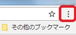
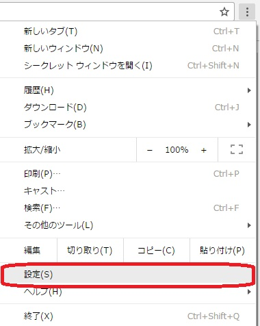
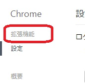
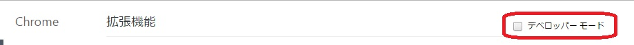
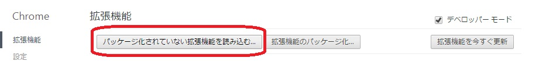
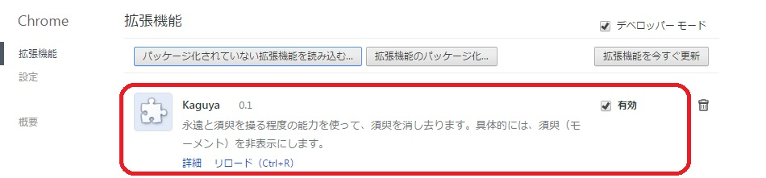

# kaguya

"Kaguya"はWeb版Twitterからモーメントを非表示にするChrome拡張機能です。

## About "kaguya"

2017/1/27にPC版TwitterのWeb画面にて、「ホーム」と「通知」の間に追加された「モーメント」タブを非表示にします。

## Why "kaguya"?

「モーメント（moment）」は「瞬間」を意味する英単語です。ということは、モーメントを消すということは瞬間を消すということになります。  
瞬間とは須臾。であれば、須臾は永遠によって恒久不変に塗り潰されるのです。  
――永遠と須臾を操る程度の能力によって。

## Install

1. "Kaguya"のファイル一式をダウンロードし、適当なフォルダに展開してください。
2. Chromeの右上にあるメニューボタンをクリックしてメニューを開きます。 
3. 「設定」の項目をクリックします。 
4. 設定画面が開きますので、一番左側のメニューの「拡張機能」をクリックします。 
5. 画面右端の「デベロッパーモード」をクリック 
6. 左側に「パッケージ化されていない拡張機能を読み込む…」というボタンが出現するので、これをクリック 
7. フォルダ階層のウインドウが表示されるので、先ほど"kaguya"をダウンロードして展開した場所を選んでください。
8. 画面のように"Kaguya"が表示され、有効化されればオーケーです。<strong>有効化したままだと危険なので、「デベロッパーズモード」のチェックを外しておきましょう。</strong>あとはTwitterの画面をリロードして、須臾を消ｓ…もとい、「モーメント」タブとはサヨナラしましょう。 

## Disclaimer

- 使用は個人使用の範囲にとどめてください。
- 使用は自己責任でお願いします。"Kaguya"を使用したことによる一切の不具合・問題・トラブルには責任を持ちません。
- 無断転載はおやめください。

## License

<a href="https://github.com/arm-band/kaguya/blob/master/LICENSE">MIT License</a>

## Author

アルム＝バンド

## Published Date

2017/2/19

- ver 0.1

## Appendix

Git、およびGithubの使い方テストも兼ねて作成。